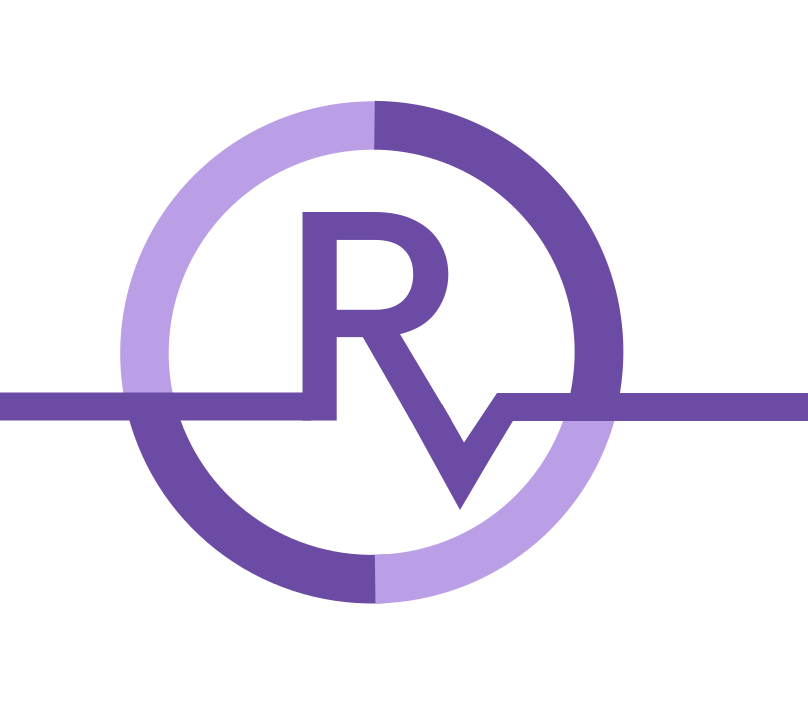
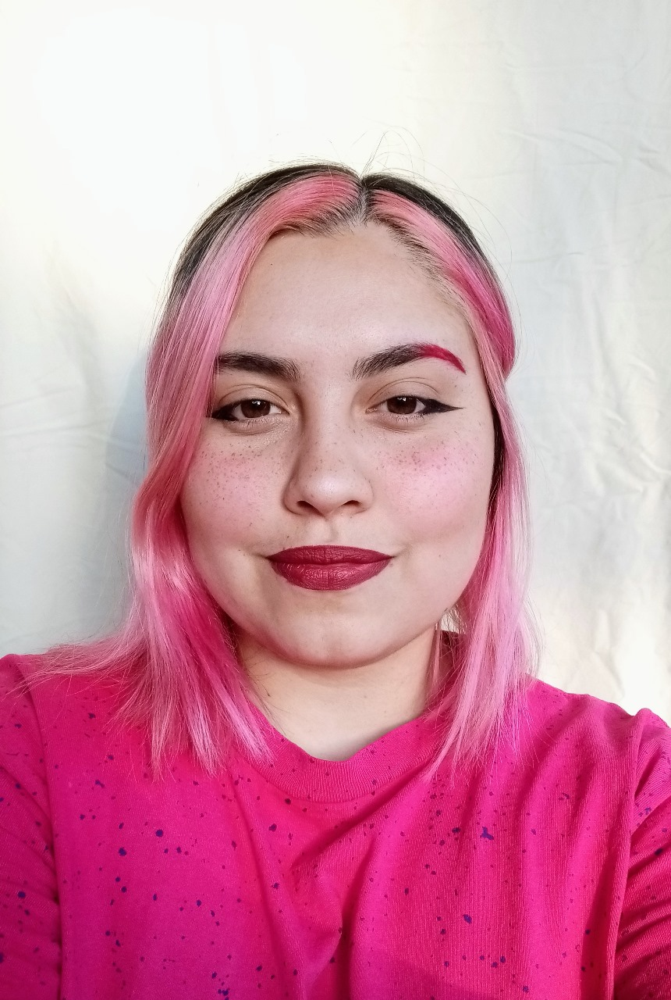
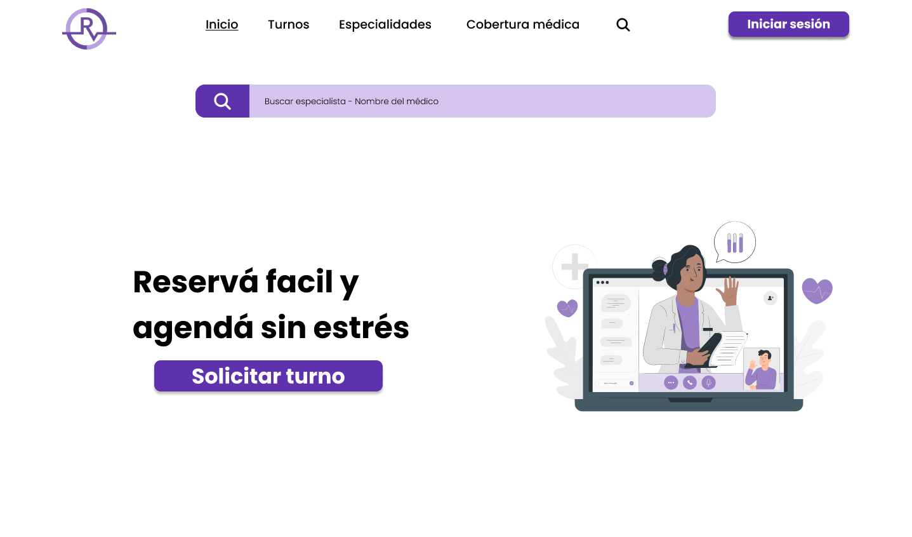
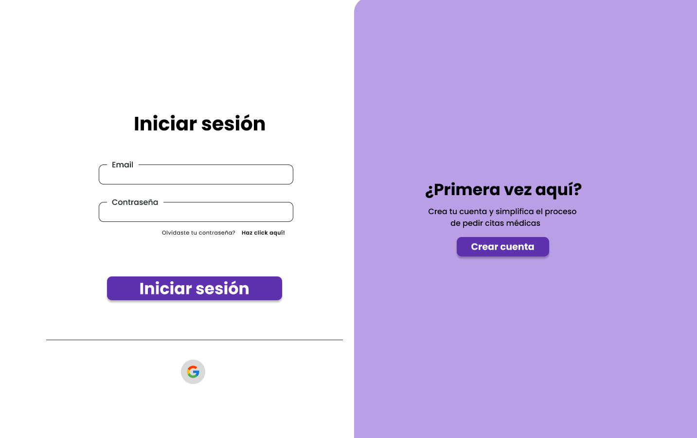
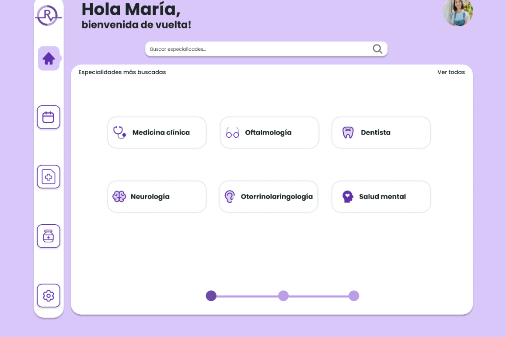
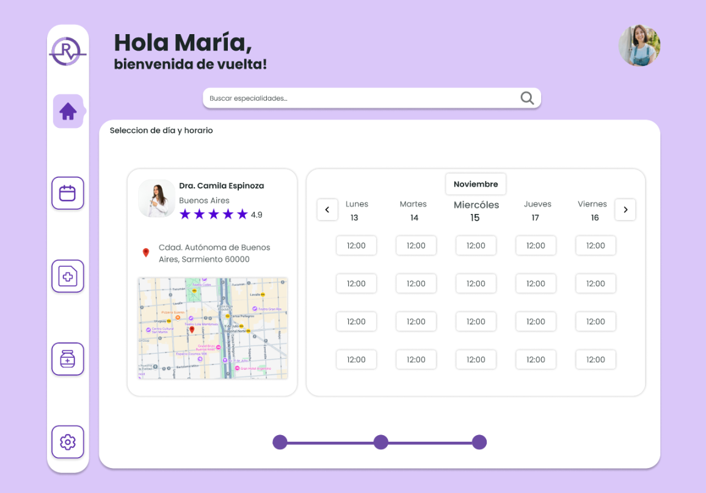

# NoCountry: C20-48-t-Python-React

Proyecto: RecetApp

![Loguito]

Versión: 1.0
Fecha:1/11/2024

Aplicación web responsiva diseñada para facilitar el acceso a servicios médicos y mejorar la experiencia del paciente. Permite a los usuarios consultar la disponibilidad de profesionales de la salud, reservar citas, y recibir recordatorios y notificaciones. Los usuarios registrados pueden gestionar sus citas, guardar sus especialistas favoritos y obtener recomendaciones basadas en sus necesidades de salud.

<h3>👥Miembros del equipo</h3>

| Avatar                                                                                                                                                       | Nombre               | Rol                                    | Redes Sociales                                                                                                                                                                                    |
| ------------------------------------------------------------------------------------------------------------------------------------------------------------ | -------------------- | -------------------------------------- | ------------------------------------------------------------------------------------------------------------------------------------------------------------------------------------------------- |
|  | Alba Sanchez | Diseñadora UX/UIr |   |
|          | Christian Gutman        | Project Manager                    |                                     |
|            | Nehuen Minvielle        | Backend Developer                 |                   |
|            | Yair Flores       | Backend Developer                                   |                         |

## 🔗Enlaces importantes
<!--- [Documentación del Proyecto](https://drive.google.com/drive/folders/1bE1Dbx32OKSVn7xdsioF0N5PbGLC9vTf?hl=es)-->
- [GitHub del Proyecto](https://github.com/No-Country-simulation/c21-28-python-react-oct2024)

## 🛠️ Tecnologías utilizadas

- **Backend**: Django
- **Base de Datos**: MySQL
- **Autenticación**: JWT (JSON Web Token)

## 🖼️ Imágenes del Proyecto

<h3>Vista Home</h3>
 

 
<h3>Vista "Login"</h3>
 

 
<h3>Vista "Especialidades"</h3>

 
<h3>Vista "Turno"</h3>

=======
Cohorte 21-28 Python React
https://dashboard.render.com/register
Reservate App
>>>>>>> 3f0309a781ea21dd2d76ac92a03df88f98364dae
